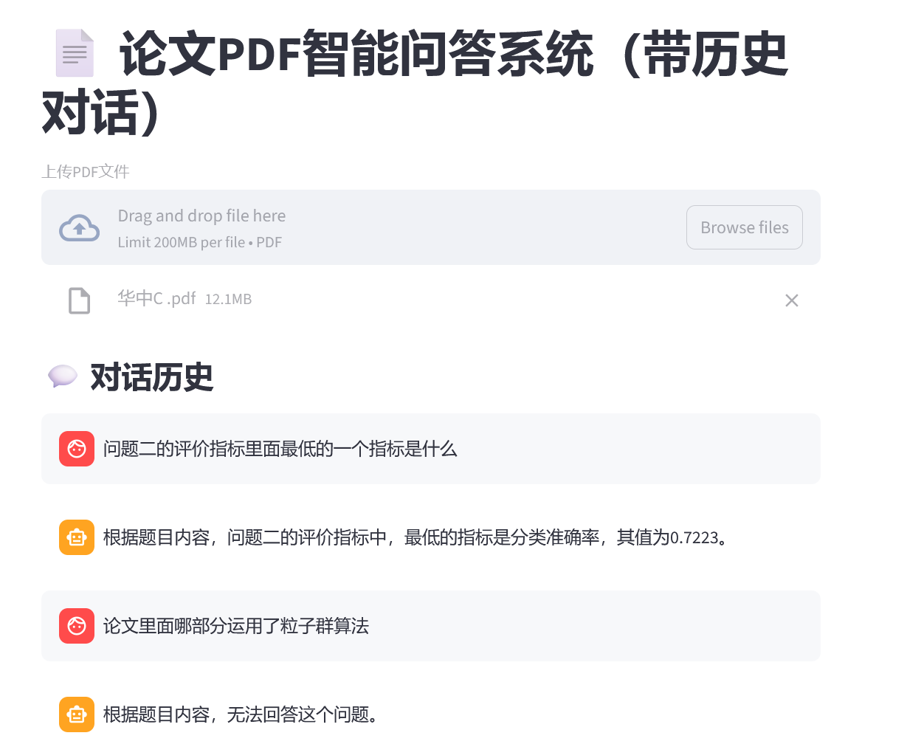

# PaperRAG

基于 RAG（检索增强生成）的智能论文 PDF 问答系统。

支持：

* PDF 文本解析
* 语义向量检索
* 上下文增强问答
* 多轮对话
* Embedding 缓存
* Streamlit Web UI


# Demo


## Tech Stack

* Streamlit
* SentenceTransformers
* OpenAI API
* NumPy
* PyMuPDF

## Installation

```bash
pip install -r requirements.txt
```

## Run

```bash
streamlit run app.py
However, please note that：change model name to fit your api_key and base_url
```

## Features

* Upload PDF files
* Semantic retrieval
* Multi-turn conversation
* Context-aware QA
* Embedding cache optimization

## License

MIT License
